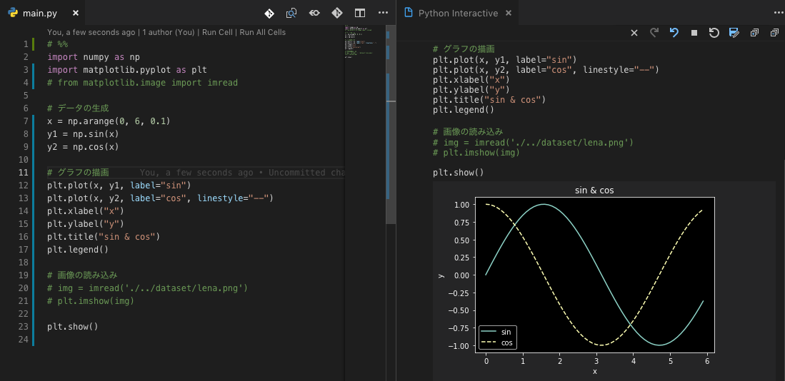
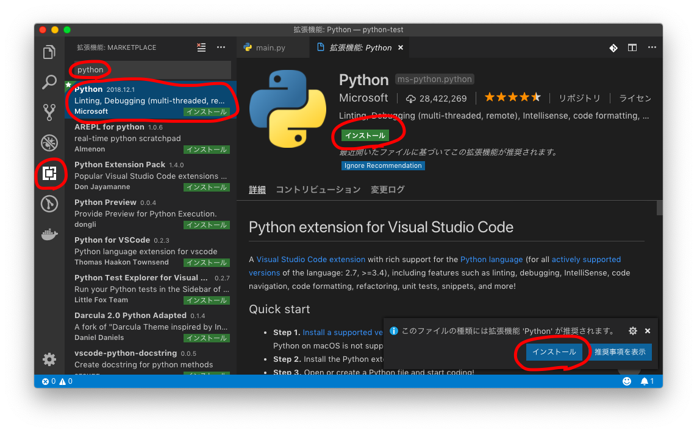
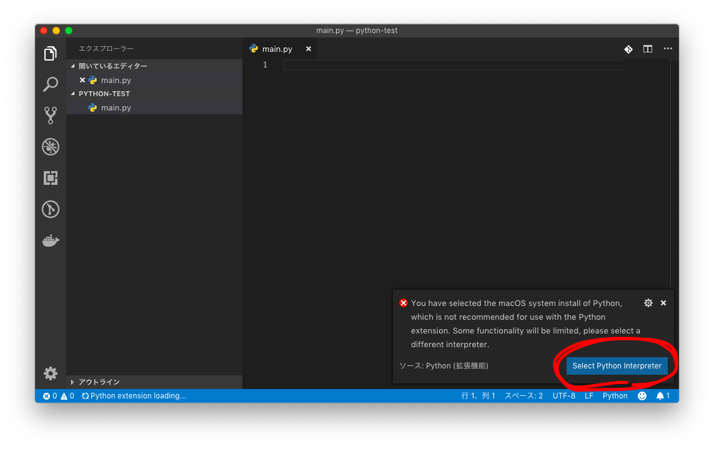
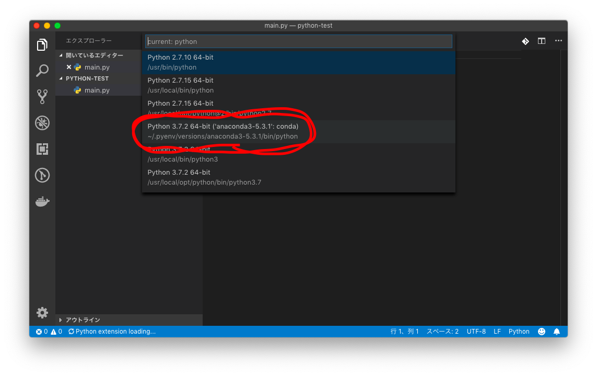
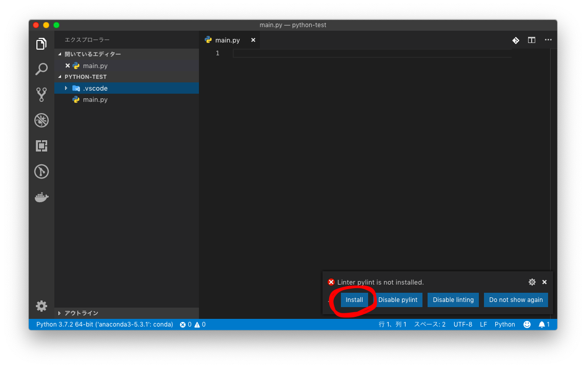
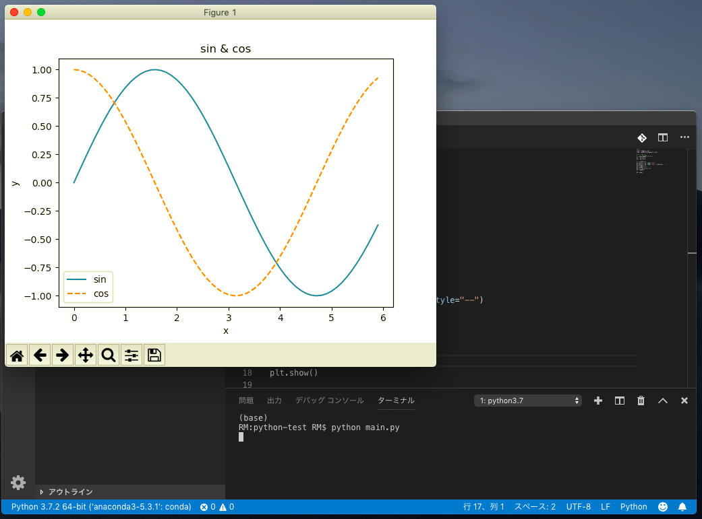
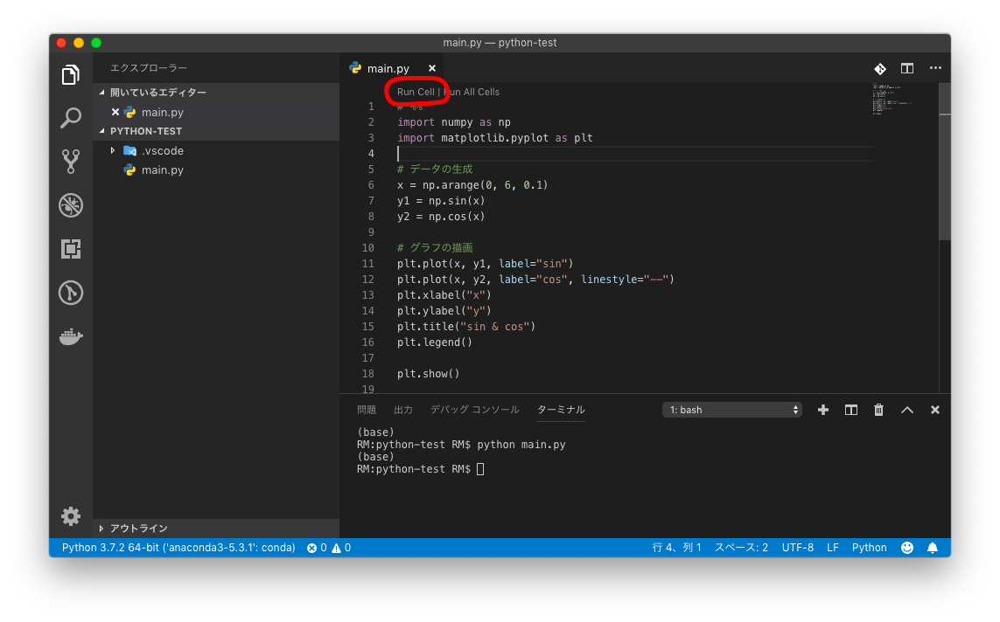
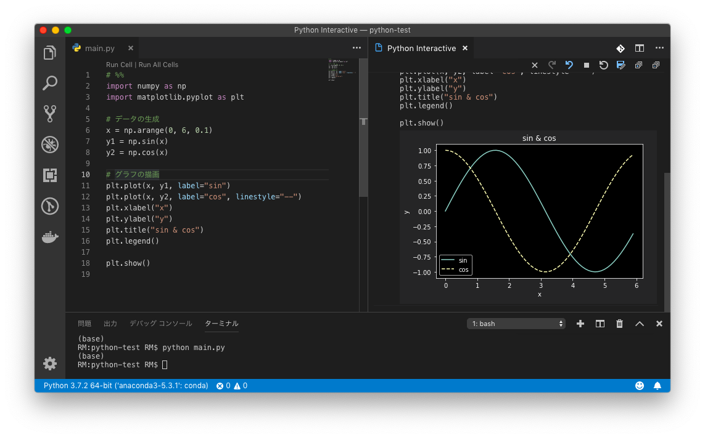
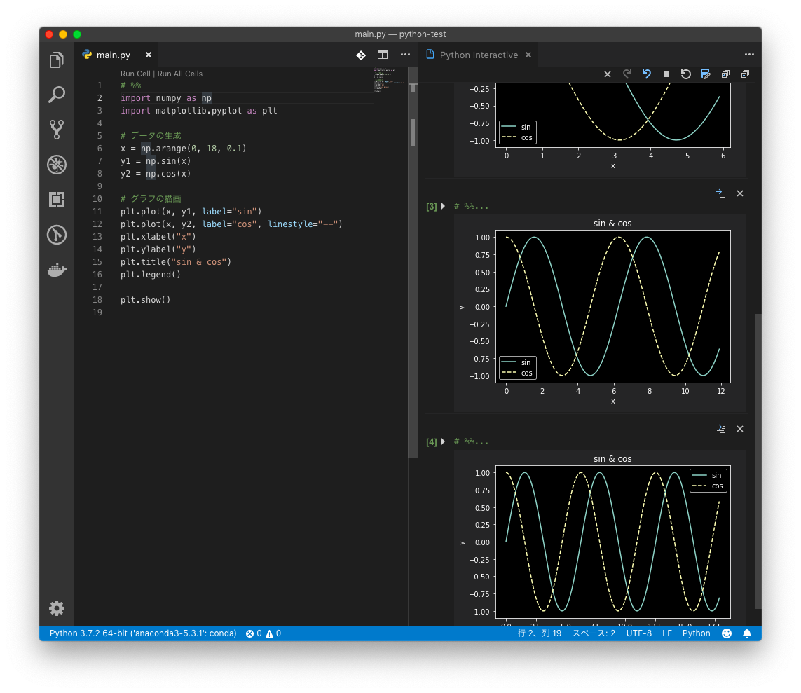

# npm に慣れた Node 出身者が機械学習に入門しようと Python に手を出したら環境構築に丸 2 日掛かった話

tags: ポエム Python pyenv VSCode Jupyter

## 概要

npm でのパッケージ管理に慣れた状態で Python の環境構築に挑んだらつまずきました。
つまづいたポイントを説明したのち、実際の構築手順を示します。
機械学習が始められるように anaconda ディストリビューションで jupyter を vscode で起動するまでの道のりです。

## キーワード

- python
- pyenv
- anaconda
- jupyter
- vscode

## つまづいたポイント

今までは Web 系一本のエンジニアでしたが、レコメンド系の機能を自分でも作ってみたいと思い、機械学習・深層学習への入門を決意しました。
そこで Python の環境構築を開始したのですが、npm によるパッケージ管理に慣れた Node 出身者にとっては Python の環境構築は試練の連続でした。

当初目標とした環境構築のゴールは次の通りです。

1. グローバル環境は極力汚さないこと
   1. Python のランタイムは Docker を使用すること
   1. 依存パッケージはプロジェクトごとに管理すること
1. テキストエディタは Visual Studiio Code を使用すること
1. Auto Complete, Lint, Fomatter が動くこと

結論としては、`1` の実現がどうしてもできず、最終的にこの目標は妥協するという形で落ち着きました。

以下つまづきポイントです。

### pip にはローカルインストールの概念がない

Python のパッケージ管理ツールと言えば `pip` というイメージでした。
Python は AWS の `AWS CLI` に使われており、そのインストール方法として `pip` を利用した方法が紹介されていました。

しかしながら、この `pip` は `npm` とは全く違った性質を持つものでした。
`npm` は `npm install xxxxxx`, `npm install xxxxxx --global` のように、ローカルインストールとグローバルインストールの区別があります。
一方で `pip` は、ローカルインストールの概念がありませんでした。全てをグローバルにインストールするだけです。

つまり、 `pip` では当初の目標であった `依存パッケージはプロジェクトごとに管理すること` が達成できません。

### pip を超えるパッケージ管理ツール pipenv

`pipenv` は `pip` によるパッケージ管理の問題を解決しようとしたプロダクトです。

- [pipenv リポジトリ](https://github.com/pypa/pipenv)
- [pipenv ドキュメント](https://pipenv.readthedocs.io/en/latest/)
- [pipenv ドキュメント日本語訳](https://pipenv-ja.readthedocs.io/ja/translate-ja/)

`README.md` によると `pipenv` は次のようなプロダクトだと言っています。

> Pipenv is a tool that aims to bring the best of all packaging worlds (bundler, composer, npm, cargo, yarn, etc.) to the Python world.

Ruby の `bundler` 、 PHP の `composer` 、 Node の `npm` といったパッケージ管理の優れた世界観を Python にも導入することを狙ったプロダクトであるとのことです。
`pipenv` は `Pipfile` と `Pipfile.lock` という 2 つのファイルによって依存モジュールの解決を図ります。

この `pipenv` は比較的新しいプロダクトで、[リポジトリ上で確認できる一番最初のリリース](https://github.com/pypa/pipenv/releases?after=v0.1.11)は 2017 年 1 月 21 日 の `v0.1.0` でした。
この記事の執筆が 2019 年 1 月 20 日なので、初リリースからギリギリまだ 2 年経っていないプロダクトということになります。

しかし、この「新しさ」が今回の環境構築における壁の一つとなりました。
Visual Studio Code でも、この `pipenv` との統合を進めているようではあるのですが、まだまだ解決すべき点が多く残っているようでした。
具体的には、`pipenv` を用いてプロジェクト単位でローカルインストールしたモジュールを上手く読み込んでくれないという事象が発生しました。
つまり、 `Auto Complete, Lint, Fomatter が動くこと` を達成できなかったのです。

### pyenv による妥協

`Python のランタイムは Docker を使用すること`、 `依存パッケージはプロジェクトごとに管理すること` の 2 つは妥協することにしました。

そこで次に目を向けたのが `pyenv` でした。
`pyenv` は、Ruby の `rbenv` 、 PHP の `phpenv` 、 Node の `nvm` と同じ立ち位置のツールで、言語の複数バージョンを管理できます。

「言語のバージョンを切り替える」というよりは、「各バージョンにおける環境を切り替える」という表現の方が近いかもしれません。
例えば、 `python3.6` の状態で `pip install` したものは、`python3.6` のグローバル環境にはインストールされますが、`python3.7` 環境に切り替えるとパス解決がされずインストールがされていない状態になります。

また、 `pyenv` は複数バージョンの「言語」だけでなく、「ディストリビューション」のインストール・切り替えも可能です。
ディストリビューションというのは、言語や必要なライブラリが一つにまとめ上げられたものです。
例えば `Anaconda` は、データ分析に重点を置いたディストリビューションで、Python 本体と数学系ライブラリ群がオールインワンになっています 。

ここで少し脇道に逸れた話をします。
機械学習・データ分析において、「Jupyter Notebook」というツールが今や欠かせないものになっています。
Jupyter Notebook は、一言でいうと電子ノートで、「プログラム」「プログラムの実行結果」「説明書き」を一括でノートに記録してくれるというツールです。
機械学習においては、例えば、ここのパラメータをこうしたらこうなった、パラメータをこっちに書き換えたらこうなった、という軌跡を記録として残せるというのは非常に強力なサポートになります。

「実行結果を出力」ではなく「実行履歴を記録」という点がポイントです。
グラフを描画するライブラリを使えば、その時点のグラフも記録として残すことができます。



話をディストリビューションに戻すと、この Jupyter Notebook が Python のインストール方法として `Anaconda` ディストリビューションを[強く推奨](https://jupyter.org/install)しているのです。

> We strongly recommend installing Python and Jupyter using the Anaconda Distribution, which includes Python, the Jupyter Notebook, and other commonly used packages for scientific computing and data science.

よって、今回は機械学習のために Python の環境構築を始めたので、 `pyenv` を用いて `Anaconda` ディストリビューションをインストールして Python の実行環境を構築する、という形に落ち着きました。

この方法だと、vscode における `Auto Complete, Lint, Fomatter` も正常に機能しました。

## 環境構築手順

それでは実際の環境構築手順を以下に示していきます。

### Requirement

- Xcode Command Line Tool
- Homebrew
- Ruby
- Visual Studio Code

### Environment

- macOS Mojave, v10.14.2
- XcodeCLT, v10.1.0.0.1.1539992718
- Ruby, v2.3.7
- Homebrew, v1.9.2
- Visual Studio Code, v1.30.2

```bash
# macOS
$ sw_vers
ProductName:    Mac OS X
ProductVersion: 10.14.2
BuildVersion:   18C54

# XcodeCLT
$ xcode-select -p
/Library/Developer/CommandLineTools

# XcodeCLT
$ pkgutil --pkg-info=com.apple.pkg.CLTools_Executables
package-id: com.apple.pkg.CLTools_Executables
version: 10.1.0.0.1.1539992718
volume: /
location: /
install-time: 1546663194
groups: com.apple.FindSystemFiles.pkg-group

# Ruby
$ ruby --version
ruby 2.3.7p456 (2018-03-28 revision 63024) [universal.x86_64-darwin18]

# Homebrew
$ brew --version
Homebrew 1.9.2
Homebrew/homebrew-core (git revision 41722; last commit 2019-01-20)
Homebrew/homebrew-cask (git revision 20ab; last commit 2019-01-20)

# Visual Studio Code
$ code --version
1.30.2
61122f88f0bf01e2ac16bdb9e1bc4571755f5bd8
x64
```

### Set up environment

`Xcode Command Line Tool` & `Ruby`

```bash
# インストール
xcode-select --install

# 確認
xcode-select -p
ruby --version

# パスが上手く通っていない場合
sudo xcode-select --reset
```

`Homebrew`

```bash
# インストール
/usr/bin/ruby -e "$(curl -fsSL https://raw.githubusercontent.com/Homebrew/install/master/install)"

# 設定に問題がないか確認
brew doctor
```

`Visual Studio Code`

インストーラーでインストール: [Download Visual Studio Code](https://code.visualstudio.com/Download)

Homebrew でインストール:

```bash
# 検索
brew search visual

# インストール
brew cask install visual-studio-code
```

### pyenv

```bash
# 既にインストールされていないか確認
which pyenv
pyenv --version

# インストール
brew install pyenv

# (再インストールしたい場合)
brew reinstall pyenv

# (最新化したい場合)
brew upgrade pyenv

# インストールされたか確認
which pyenv
pyenv --version

# 設定を .bash_profile に書き込む
echo '# Pyenv' >> ~/.bash_profile
echo 'export LDFLAGS="-L/usr/local/opt/readline/lib"' >> ~/.bash_profile
echo 'export CPPFLAGS="-I/usr/local/opt/readline/include"' >> ~/.bash_profile
echo 'export PKG_CONFIG_PATH="/usr/local/opt/readline/lib/pkgconfig"' >> ~/.bash_profile
echo 'export PYENV_ROOT="$HOME/.pyenv"' >> ~/.bash_profile
echo 'export PATH="$PYENV_ROOT/bin:$PATH"' >> ~/.bash_profile
echo 'eval "$(pyenv init -)"' >> ~/.bash_profile

# シェルを再起動して設定を反映させる
exec $SHELL -l
```

### Anaconda

```
# インストール可能なものを一覧表示
pyenv install --list

# anacondaディトリビューションのインストール
pyenv install anaconda3-5.3.1

# (anacondaディトリビューションをアンインストールしたい場合)
pyenv install anaconda3-5.3.1

# 現在アクティブなバージョンを表示
pyenv version

# 利用可能なバージョンを一覧表示
pyenv versions

# バージョンを指定してアクティブ化
pyenv global anaconda3-5.3.1

# 確認
conda info -e
which python
which python3
which pip
which pip3
python --version
python3 --version
pip --version
pip3 --version

# pipの最新化
pip install --upgrade pip

# インストール済みライブラリの一覧表示
conda list
```

### Visual Studio Code

実際にコードを書いて実行してみます。

まずは、ディレクトリとファイルを作成します。

```bash
# プロジェクトディレクトリの作成
mkdir ~/Documents/python-test

# ディレクトリの移動
cd $_

# ファイルの作成
touch main.py
```

Visual Studio Code を起動して作成したディレクトリ、ファイルを開きます。

まずは `Python` の拡張機能をインストールします。
インストール後は Visual Studio Code を再起動します。



拡張機能をインストールした状態で python のファイルを開くと、interpreter を選択するように促されます。
pyenv 環境の interpreter を選択します。




Linter や Fomatter 関連のライブラリのインストールを促される場合があります。
これらは全てインストールして構いません。



コードを書いていきます。 `main.py` に次のコードを書きます。

```python
# %%
import numpy as np
import matplotlib.pyplot as plt

# データの生成
x = np.arange(0, 6, 0.1)
y1 = np.sin(x)
y2 = np.cos(x)

# グラフの描画
plt.plot(x, y1, label="sin")
plt.plot(x, y2, label="cos", linestyle="--")
plt.xlabel("x")
plt.ylabel("y")
plt.title("sin & cos")
plt.legend()

plt.show()
```

ターミナルを起動して、 `python main.py` でプログラムを実行します。
すると、別ウィンドウでグラフが描画されます。



次に `Jupyter Notebook` でプログラムを実行してみます。
ソースコード上の `# %%` の上部に表示された `Run Cell` をクリックします。
すると、Visual Studio Code の Python 拡張機能に統合された Jupyter Notebook が起動し、新しいウィンドウが立ち上がって実行結果が出力されます。




Jupyter Notebook は実行結果の出力だけではなく、実行履歴の記録もしてくれます。
試しに `main.py` の 6 行目の第 2 引数を 6 -> 12 -> 18 と変えながら `Run Cell` を実行します。
すると、以前の実行結果を残しつつ、新しい実行結果を表示してくれます。



## さいごに

npm のようなパッケージ管理ツールが python にはない（正しくは最近になってようやく登場し、発展途上）ということを初めて知り、驚いたと同時に今までの常識が通じずに環境構築をする上でかなり躓きました。

pipenv がより一層発展し、IDE との統合が進むまでは pyenv での環境を使っていこうと思います。

もしこの記事が面白いと感じていただけた方がいらっしゃいましたら、もしよろしければ Twitter のフォローをお願いいたします！
インドア派で勉強会とかにもあまり参加しないのでエンジニア友達が少なくて泣けます・・・！
フォローは全て返しますので、ぜひお話しましょう！

Twitter: [@\_rema424](https://twitter.com/_rema424)
